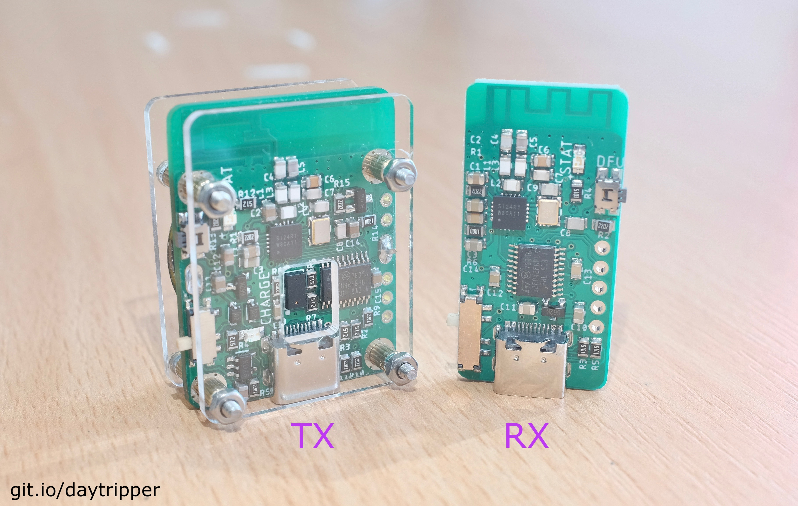
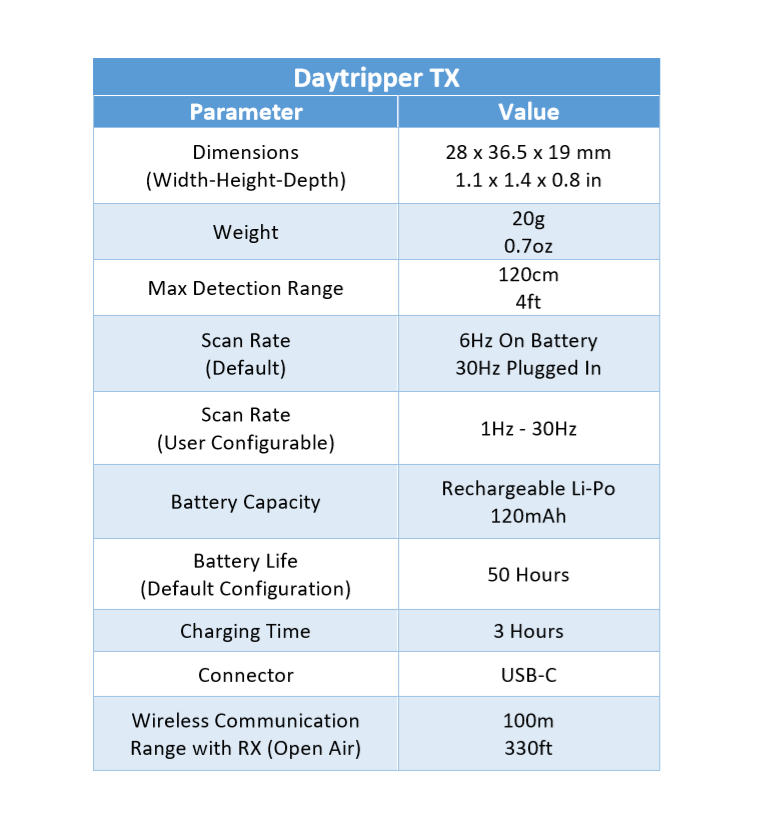
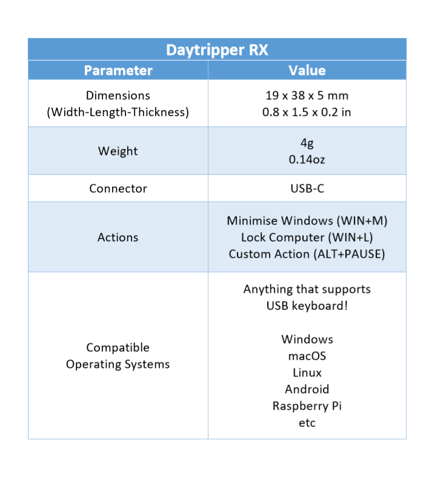

# Daytripper: Hide-My-Windows Laser Tripwire

[Buy on Tindie!](https://www.tindie.com/products/dekuNukem/daytripper-hide-my-windows-laser-tripwire/) | [Official Discord](https://discord.gg/VM4kbnf) | [Getting Started](quick_start_guide.md)

-----

Do you always slack off on your computer and worry about getting busted?

Not anymore because Daytripper is here to save the day!

Daytripper is a laser tripwire that can, upon triggering:

* Hide all your windows
* Lock your computer
* [Execute a custom script](/advanced_usage.md) to do whatever you want!

## Buy Daytripper on Tindie!

I did a small production run, and you can buy them directly on Tindie:

https://www.tindie.com/products/dekuNukem/daytripper

## How it Works

Daytripper comes in two parts: a Transmitter (TX) and a Receiver (RX).

Mount the TX in the path of incoming threat. Plug RX into your computer.

When motion is detected, RX will press `Win + M` and instantly hide what you're doing.

Alternatively, it can also lock your PC or [execute a custom script](/advanced_usage.md).

## Features

Daytripper...

* Can detect motion within 120cm (4 ft).

* Scan rate: 6Hz on battery, 30Hz while powered. Customisable with included software.

* Configurable parameters to suit your particular needs.

* 50-hour battery life, rechargeable via USB-C.

* Works out-of-box with Windows, compatible with all major OSs.

* 100 meter (330 ft) open-air communication range between TX and RX.

* Comes with a magnetic mounting kit.

* See [Quick Start Guide](https://github.com/dekuNukem/daytripper/blob/master/quick_start_guide.md) and [Advanced Usage Guide](https://github.com/dekuNukem/daytripper/blob/master/advanced_usage.md) for more details.

## Getting Started

If you received your Daytripper in kit form, follow this to put it together:

[Kit Assembly Guide](/assembly_guide.md)

For how to use Daytripper, see this:

[Quick Start Guide](/quick_start_guide.md)

For advanced features such as custom actions and adjusting settings, read this:

[Advanced Usage](/advanced_usage.md)

## Specification

## FAQ

### What operating system is supported?

Daytripper works out-of-box with Windows. No driver needed.

It is also compatible with anything that supports USB keyboards, such as Linux, MacOS, Android, and more.

Read [Advanced Usage Guide](/advanced_usage.md) to see how to use it on other systems.

### What is the range of Daytripper?

The laser ToF sensor can detect motion within 120cm (4 ft).

The wireless communication range between TX and RX should be around 100 meters (330 feet) open air. Might be less in indoor environments. 

### Battery life?

Around 50 hours (more than 2 days!) with default configuration.

Can be increased or decreased by adjusting settings.

Rechargeable via USB Type-C connector.

### Can I use it for purposes other than hiding windows?

Yes. It can also lock your computer, or perform a custom action.

See [Advanced Usage Guide](/advanced_usage.md).

## I Want One!

I did a small production run, and you can buy them directly on Tindie:

https://www.tindie.com/products/dekuNukem/daytripper

## Questions or Comments?

Please feel free to [open an issue](https://github.com/dekuNukem/duckypad/issues), ask in the [official Daytripper discord](https://discord.gg/VM4kbnf), DM me on discord `dekuNukem#6998`, or email `dekuNukem`@`gmail`.`com` for inquires.
