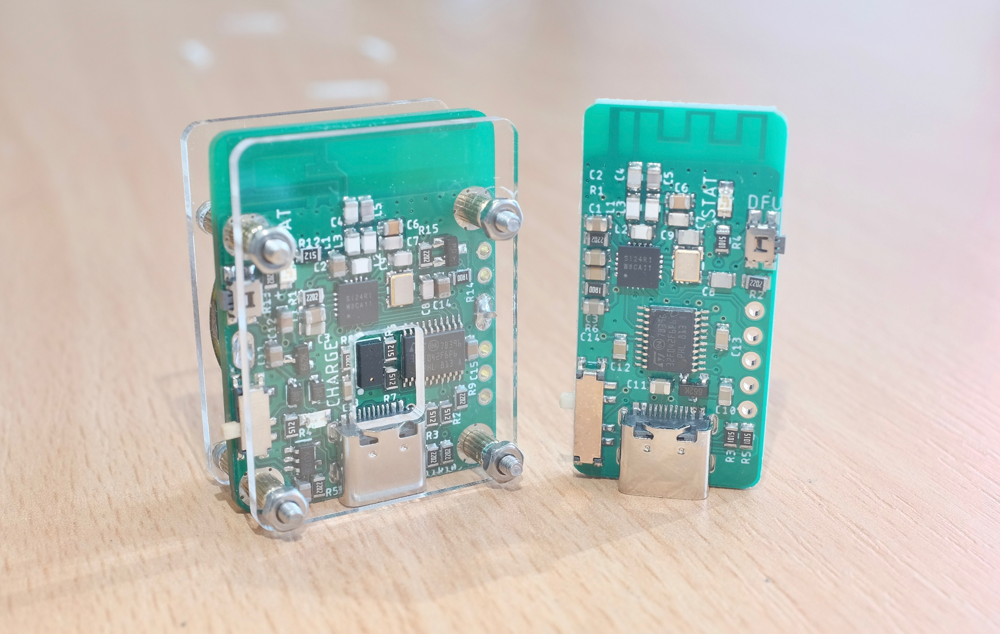

# Daytripper: Hide-My-Windows Laser Tripwire

Daytripper is a laser tripwire that hides all your windows when triggered.

`daytripper gif`

comes in two parts, TX and RX, TX has a laser tof sensor on it and sends a wireless signal to RX, which acts like a USB keyboard and press shortcut keys to minimize or lock your computer. 

## Buy Daytripper on Tindie!

I did a small production run and you can buy them directly on Tindie:

https://www.tindie.com/products/dekuNukem/daytripper/

## Getting Started

If you received your Daytripper in kit form, follow this to put it together:

[Kit Assembly Guide](/assembly_guide.md)

For how to use Daytripper, see this:

[Quick Start Guide](/quick_start_guide.md)

For advanced features such as custom actions, multiple modules, and firmware updates, read this:

[Advanced Usage](/advanced_usage.md)

## FAQ

### What operating system is Daytripper compatible with?

Daytripper works out-of-box with Windows, from XP to 10.

It is also compatible with anything that supports USB keyboards, such as Linux, MacOS, Android, iOS, and more.

Read [Advanced Usage Guide](/advanced_usage.md) to see how to use it on other systems.

### Can I use it for purposes other than hiding windows?

Yes. It can also lock your computer, or perform a custom action.

See [Advanced Usage Guide](/advanced_usage.md).

### What is the range of Daytripper?

The laser ToF sensor can detect motion within 120cm (47 inches).

The wireless communication range between transmitter and receiver should be around 100 meters (330 feet) open air. Might be less in indoor environments. 

### How is the battery life?

Around 40 hours, depending on the number of triggers. Rechargeable via USB Type-C connector.

## Questions or Comments?

Please feel free to [open an issue](https://github.com/dekuNukem/daytripper/issues). This is the preferred way since it helps other people too.

You can also email me at `dekunukem gmail com` for inquires.