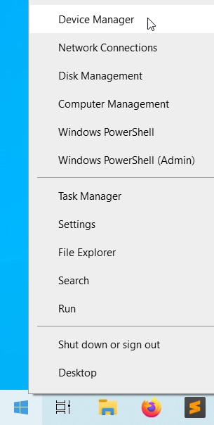
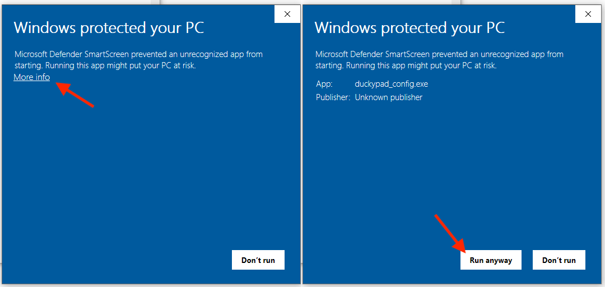
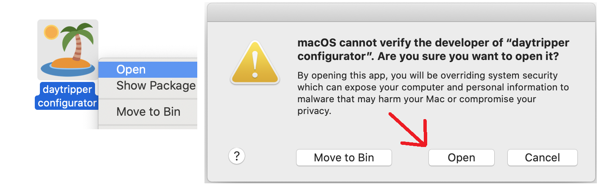
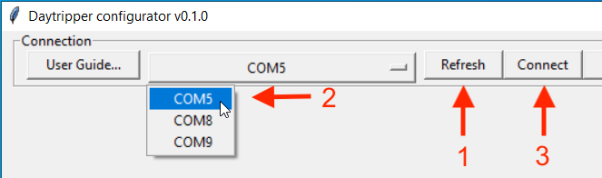
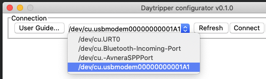
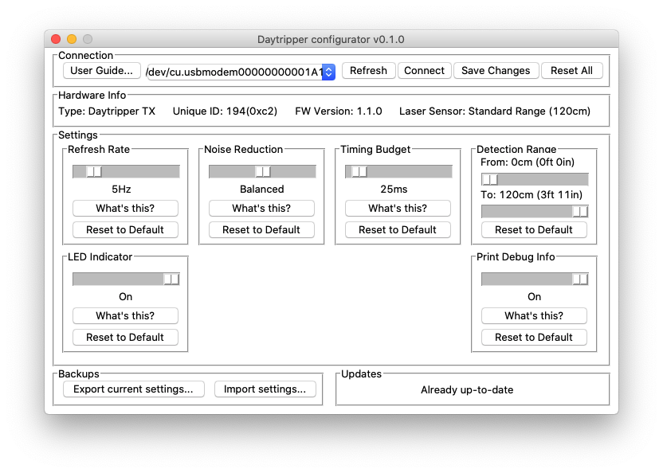

# Daytripper Advanced Usage Guide

[Main Page](/README.md) | [Buy Daytripper](https://www.tindie.com/products/dekuNukem/daytripper)

------

If you're not familiar with Daytripper yet, please see the [Quick Start Guide](/quick_start_guide.md) first.

## Table of Contents

[Creating Custom Actions](#custom-actions)

[Adjusting Advanced Parameters](#adjusting-advanced-parameters)

[On-Air Packet Format](#on-air-packet-format)

[Debug Mode](#debug-modes)

[USB Firmware Update](#usb-firmware-updates)

[Trigger Output](#trigger-output)

[Using Multiple Modules](#using-multiple-modules)

## Custom Actions

Instead of hiding windows, you can perform custom actions when TX is triggered.

Slide the `Mode Select` Switch on RX to `CUSTOM`, middle position. Now `ALT + PAUSE` will be pressed when TX is triggered. 

This key combo normally doesn't do anything, but you can capture it with a software and then perform your own actions. 

### Windows 

You can use [autohotkey](https://www.autohotkey.com). It is a powerful and free open-source keyboard automation program, where you can write a script to do anything you want when `ALT + PAUSE` is pressed by RX.

Check out the [official tutorials](https://www.autohotkey.com/docs_1.0/Tutorial.htm), and here's a [sample configuration file](resources/AutoHotkey.ahk) upon which you can tinker with. 

### macOS

When you first plug RX into your mac, a window might pop up asking to identify keyboard layout, simply close it.

Go to `System Preferences` -> `Keyboard` -> `Shortcuts` -> `App Shortcuts`:

Click the box to the right of `Keyboard Shortcut`, trigger the TX, and it will fill in the box for you.

You can then add a shortcut to launch an application, or execute an applescript.

For more advanced scripting needs, you can try [bettertouchtool](https://folivora.ai), which can be considered macOS equivalent of autohotkey.

### Android

Believe it or not Daytripper also works on Android!

You can use [Tasker](https://tasker.joaoapps.com) with [Autoinput plugin](https://joaoapps.com/autoinput/).

Here is a tutorial: https://forum.joaoapps.com/index.php?resources/react-to-keys-from-a-real-keyboard.79/

### Linux

Oh I'm sure you'll figure it out 😉

## Adjusting Advanced Parameters

The default settings of Daytripper demonstrates a good balance between accuracy, sensitivity, and battery life. 

However, you can also adjust them to suit your particular needs.

### Update the Firmware

If you purchased your Daytripper before **`Sept 2020`**, you will need to update your TX to the latest firmware. Please do so by following the [USB Firmware Update](#usb-firmware-updates) section below.

### Find the COM Port

**`Right click`** on the start button, then select `Device Manager`:

Make sure the TX is **`TURNED OFF`**, then plug it into your computer with a USB-C cable.

In the `Ports (COM & LPT)` section, A new `USB Serial Device` should appear.

Remember the number! **`COM5`** in this case. Yours might be different.

### Download the Application

[Head here to download the latest release](https://github.com/dekuNukem/daytripper/releases/latest) for Windows and macOS.

* The software is in early stages of development. If you run into any problems, please don't hesitate to [open an issue](https://github.com/dekuNukem/daytripper/issues), DM me on discord `dekuNukem#6998`, or contact me through `dekuNukem`@`gmail`.`com`.

### "Untrusted App" Warnings

When trying to run the app, your system might complain about this software being untrusted. This is because I haven't had the code digitally signed, which costs hundreds of dollars a year.

Please feel free to [review the code](https://github.com/dekuNukem/daytripper/tree/master/pc_software). If you don't trust the app, you can run the `duckypad_config.py` script itself with Python3.

For Windows 10, click `More info` and then `Run anyway`.

For macOS, **`RIGHT CLICK`** on the app and select `Open`. You might have to do it twice.

After the app has launched, press `Refresh` button, select the COM port with the correct number, and press `Connect`.

On macOS or Linux, the serial port will have different names, and mostly likely will have the word `usb` in it.

Anyway, if connection is successful, a number of options is presented:

* Drag the slider to adjust values.

* Click **`What's this?`** to learn about a particular setting.

* To return to default, click **`Reset to Default`** in a section, or **`Reset all`** on top right corner.

* Click **`Save Changes`** to save the current configuration to your Daytripper.

* You can make a backup of your settings with the buttons on lower left corner.

* A description of parameters follows.

### Refresh Rate

How many times per second TX takes a reading **`while on battery`**. Turn it up to make TX more sensitive to faster motions, at the expense of battery life.

Here is a table of approximate Battery Life vs Refresh Rate:

| Refresh Rate (Hz) | Battery Life (Hours) |
|-------------------|----------------------|
| 2                 | 100                  |
| 6 (Default)       | 50                   |
| 10                | 30                   |
| 15                | 20                   |
| 30                | 12                   |

Please note that your battery life might be more or less depending on your lighting conditions and number of triggers.

TX will always run at fastest refresh rate (30Hz) when plugged in.

### Noise Reduction

By default TX will take additional readings to prevent false triggers from sensor noise.

If turned off, TX will become **`much more`** sensitive to motion, but might also produce false triggers from time to time.

Turn it off if motion sensitivity is absolutely critical and occasional false triggers is acceptable.

### Timing Budget

Amount of time allocated to the laser sensor to produce a reading.

A larger value gives more accurate measurements, at the expense of reduced battery life and refresh rate.

I suggest leaving it at default for normal operations.

### Detection Range

Adjust the values here if you want Daytripper to only monitor motions within a certain distance range.

### LED Indicator

The blue LED comes on when TX is triggered. You can disable it to make your Daytripper less noticeable.

### Print Debug Info

TX prints some debug messages through its hardware UART. Turning it off might save a tiny bit of battery life.

### Save It!!

Again, don't forget to press **`Save Changes`** button to save the current configuration to your Daytripper.

## On-air Packet Format

Daytripper uses a nRF24L01-compatible chip called Si24R1. It is less expensive, and actually has a higher TX power output, resulting in longer communication range.

Daytripper operates at `channel 115`, `address 0xDA 0xBB 0xED 0xC0 0x0C`.

Data rate is `250kbps`, TX power is `+7dBm`, `Auto Acknowledgment` is used.

Daytripper TX sends 6-byte packets, details below:

* The first byte (byte 0) is a unique identifier calculated from the microcontroller serial number. 

* Second byte (byte 1) denotes what this packet is about. It can be either a test packet, trigger packet, or status update packet.

* The rest 4 bytes are payloads, their meaning depending on the command type (byte 1).

* For a `Test` packet, the 4 bytes are the same incrementing sequence number repeated 4 times. 

* For a `Trigger` packet, the first two bytes are the baseline reading of the power-up calibration. And the last two bytes are the actual distance reading. Unit in mm.

* For a `status` packet, the first two bytes are the latest battery voltage reading in mV. The last two bytes are the time-since-power-on count, multiply it by 5 to get the number of seconds elapsed since TX power-on.

* The `vbat_mV` is about 300mV lower than the actual battery voltage, due to the diode drop. 

## Debug Modes

There is a user button on both TX and RX board. Usually they are unused:

For TX, a short press (less than 2 seconds) recalibrates the baseline. A long press (more than 2 seconds) enters Test Mode, where it sends test packets with incrementing sequence number as payload every second. It can be used to test communication range. Turn it off then on again to exit Test Mode. 

For RX, a press on the button types out some debug messages. Make sure you open a text editor first. If the RX has not received any messages from the TX, the debug values will all be zero.

## USB Firmware Updates

You can update Daytripper's firmware via USB, for bug fixes and and/or new features. 

First, [click me](https://github.com/dekuNukem/daytripper/raw/master/resources/en.stsw-stm32080_stm32_DfuSe.zip) to download and install the `STM32 DfuSe tool` from this repo.

(You can also get it from [the official website](https://www.st.com/en/development-tools/stsw-stm32080.html), but it requires creating an account.)

Locate the user button on the board:

To update firmware:

* Make sure the board is TURNED OFF and unplugged.

* **Press and hold down the user button** while plugging it into a computer.

* Once it is plugged in, you can release the button.

* If all goes well, the blue LED should stay off.

Now launch the `DfuSeDemo` software:

You should see a `STM Device in DFU Mode` in the `Available DUF Devices` section at top left corner.

Press the `Choose...` button and select a firmware file in `.dfu` format. Make sure it's the correct file!

* [Click me](https://github.com/dekuNukem/daytripper/raw/master/firmware/dfu_files/TX_1.1.1.dfu) for latest default TX firmware

* [Click me](https://github.com/dekuNukem/daytripper/raw/master/firmware/dfu_files/RX_1.0.1.dfu) for latest default RX firmware

* [Click me](/firmware_version_history.md) for older firmwares.

Press `Upgrade` button to start uploading the new firmware into the microcontroller.

And now the firmware is being updated!

It could take anywhere between a few seconds to a few minutes. Try using different USB ports if it is particularly slow. 

After uploading is complete, unplug and turn it back on to start using the new firmware. 

-----

If you generated a `.hex` file yourself, you can convert it to a `.dfu` file with the `Dfu file manager` and then upload this way. 

This method is nice for occasional firmware updates, but quite cumbersome if you want to do extensive reprogramming. It's faster to get a ST-Link programmer and use the Keil uVision IDE. [See this guide](https://github.com/dekuNukem/STM32_tutorials) for more information on STM32 developments.

## Trigger Output

There is an **`active-high`** trigger output on RX. This pin will go from GND to 3.3V for **`around 200ms`** when a trigger from TX is received.

On earlier production runs, the pin is on a testpad. On the later runs, the pin has its own header hole.

Make sure **everything is on the same GND** when connecting external circuits!

Unfortunately, TX does not have a dedicated trigger out pin due to limited microcontroller pins. However, there is a debug output that prints out some serial data upon triggering, which you can parse.

## Using Multiple Modules

Daytripper wasn't really designed with multiple TX/RX boards in mind. I haven't done any extensive testings on this subject, however most of the time it does seem to work.

### Single RX Multiple TX

In this scenario RX will react when ANY of the multiple TX fires.

### Single TX Multiple RX

Here ALL of RX will react when TX fires.

### Multiple TX Multiple RX

Untested, probably a mess. 

## Questions or Comments?

Please feel free to [open an issue](https://github.com/dekuNukem/duckypad/issues), DM me on discord `dekuNukem#6998`, or email `dekuNukem`@`gmail`.`com` for inquires.

------

[Main Page](/README.md) | [Buy Daytripper](https://www.tindie.com/products/dekuNukem/daytripper)
