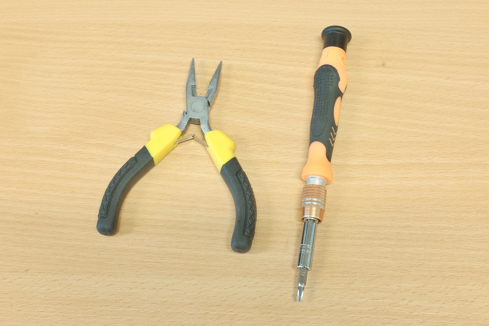
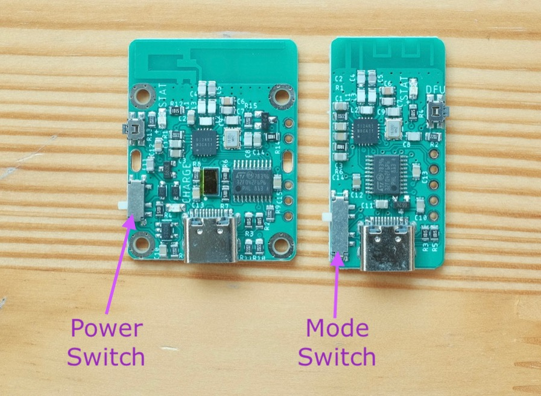
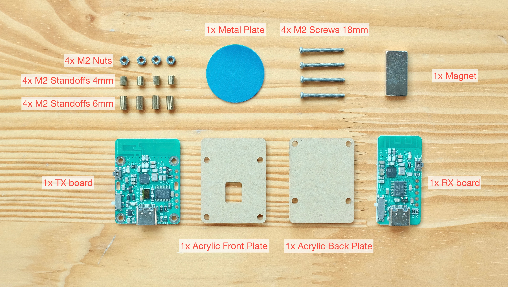
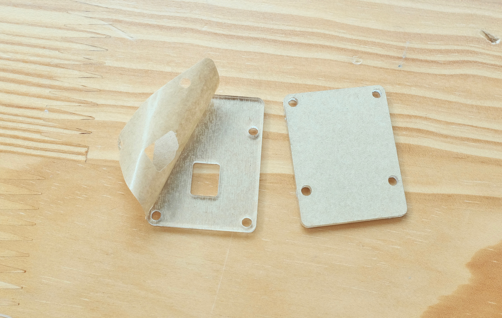
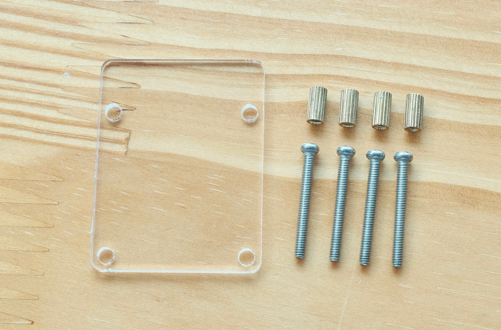
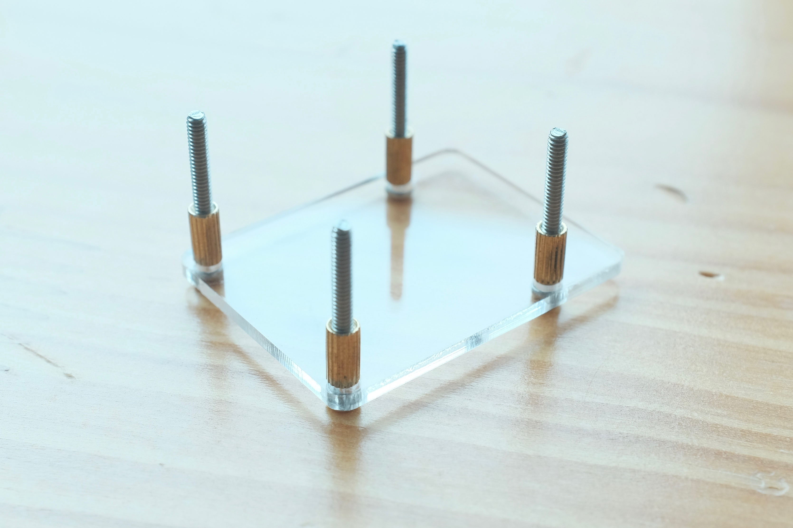
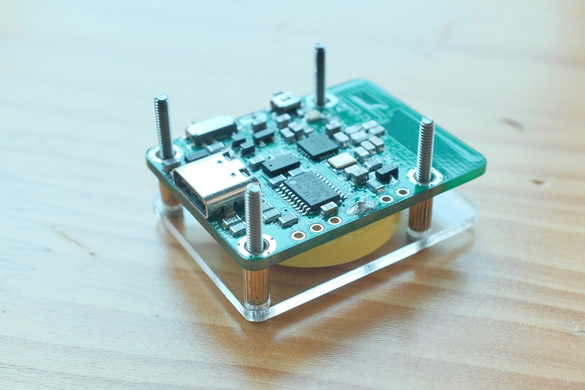
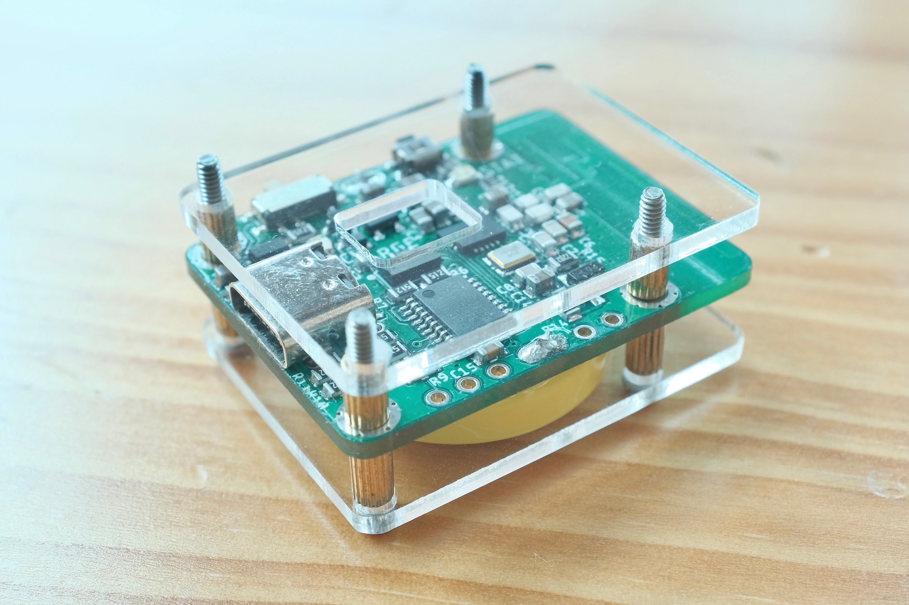
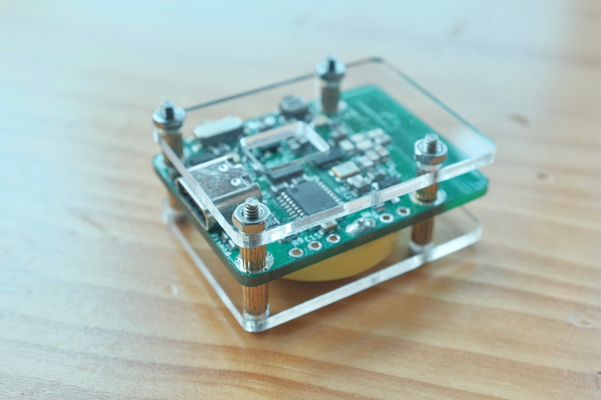
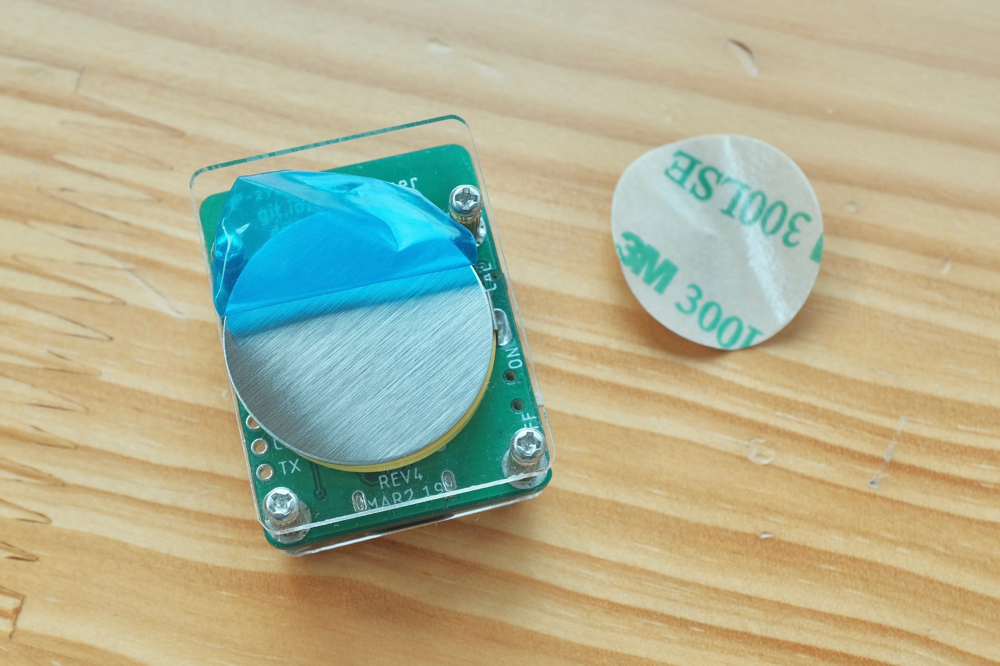

# Daytripper Kit Assembly Guide

[Main Page](/README.md) | [Buy Daytripper](https://www.tindie.com/products/dekuNukem/daytripper)

------

Thanks for purchasing Daytripper! Here is a short guide on how to put everything together.

If yours is already assembled, please move on to the [Quick Start Guide](/quick_start_guide.md).

## Recommended Tools

A pliers and a small Phillips-head screwdriver would make tightening the fasteners easier.

However this assembly is perfectly doable with your bare hands, so don't sweat if you don't have them.

## Handling Bare Circuit Boards

When handling the bare circuit board, remember to:

* Wash your hands first

* Always hold the circuit board by its edge

* Don't touch the components

The reason for hand-washing is to reduce the risk of static electricity(SE) on your body zapping the board and damage it, especially in dry weather.

By washing your hands, you release the existing SE through the metal water pipe, your hands are moist to prevent further SE build-up, and your clean hands won't leave greasy fingerprints all over the place, win-win-win!

Of course, your hands can't be dripping wet either, but that's just common sense.

## Mind the Switches!

During assembly, be careful not to accidentally break off the handles of the switches on the two circuit boards:

## Assembly Steps

You should have the following parts, keep a note of their names as I'm going to refer to them later. 

First off peel off the protective film on the `Acrylic Front and Back plate`. You don't have to do it if you like the unpeeled look. 

Gather the `Acrylic Back Plate`, `4x M2 Standoffs 6mm`, and `4x M2 Screws 18mm`.

Thread the screw through the hole, then screw on the standoffs.

Do not overtighten the standoff! Doing so might crack the acrylic plate. Finger-tight is OK, just make sure they're not loose and doesn't rattle.

Wash your hands, grab the circuit board by its edge, and install the `TX board` as shown:

Screw on the `4x M2 Standoff 4mm`. Moderately tighten.

* If you're using pilers, make sure it doesn't bump into circuit board components while turning!

Install the `Acrylic Front Plate` as shown. 

Put on the nuts. Again don't overtighten. Might be easier with pilers. 

Flip it over. Clean the backplate with a dry cloth if dirty.

Peel the metal plate from the white side to expose the adhesives.

Stick the metal plate to the back plate, preferably where the battery is. 

Peel off the blue protective film, and we're done!

Now your Daytripper is ready to use! Head over to the [Quick Start Guide](/quick_start_guide.md) to get going.

## Questions or Comments?

Please feel free to [open an issue](https://github.com/dekuNukem/duckypad/issues), ask in the [official Daytripper discord](https://discord.gg/VM4kbnf), DM me on discord `dekuNukem#6998`, or email `dekuNukem`@`gmail`.`com` for inquires.

------

[Main Page](/README.md) | [Buy Daytripper](https://www.tindie.com/products/dekuNukem/daytripper)
