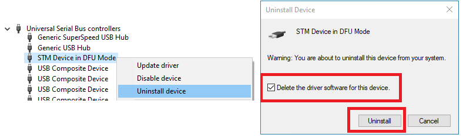
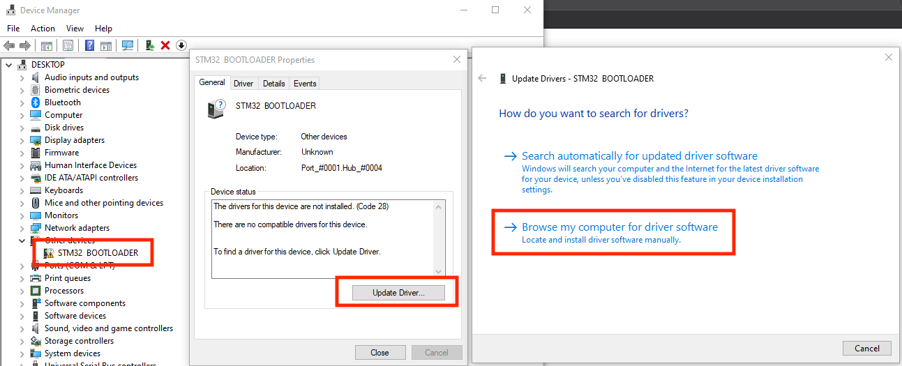
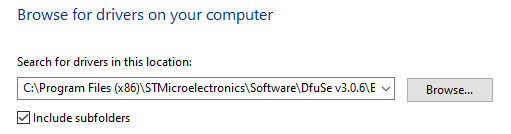
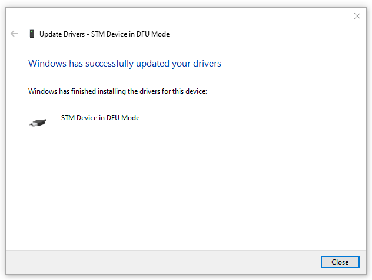

# Installing the STM32 DFU Driver

First, make sure you have followed the procedure of **`holding down the DFU button while plugging in the device`**.

Once plugged in, you can release the button. The lights and screen should stay off.

If nothing shows up in `STM32 DfuSe tool`, you probably need to install a driver.

## Driver Install Instructions

**`Right click`** on the start button, then select `Device Manager`:

Expand the node for USB devices. If you see a device with a similar name to **`STM32 Bootloader`**:

Right click, select `Uninstall Device`, check `Delete driver software` box, then press `Uninstall`.

Now you should have a **`STM32 BOOTLOADER`** device with yellow triangle.

**`Double click`** on it, select `Update Driver...`, then select `Browse my computer for driver software`

Press `Browse...`, and select the entire folder below:

`C:\Program Files (x86)\STMicroelectronics\Software\DfuSe v3.0.6\Bin\Driver\Win10`

Windows should find and install the driver automatically.

After it's done, you can continue the guide as usual.