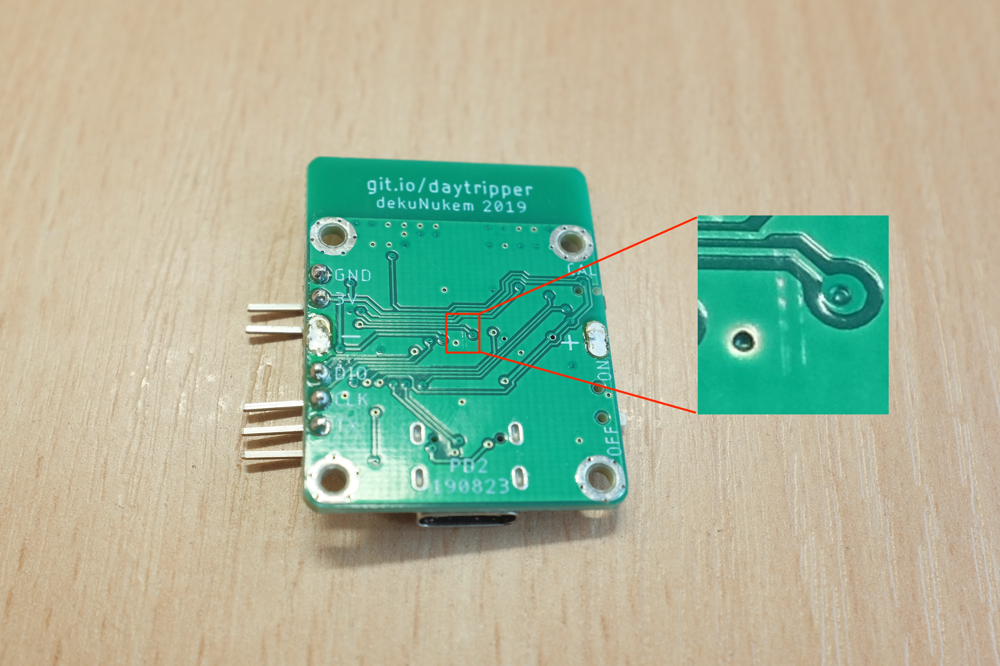
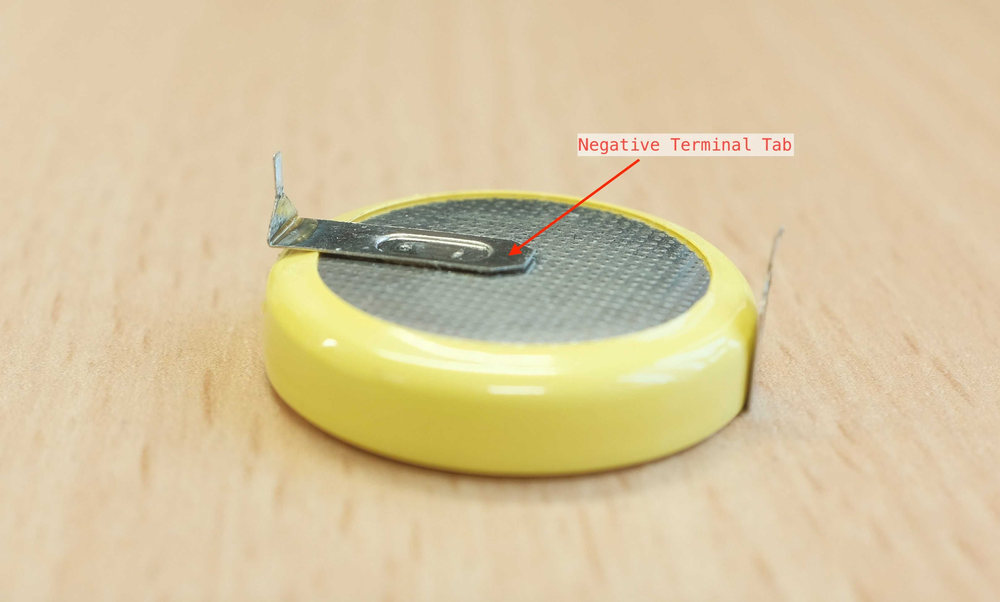
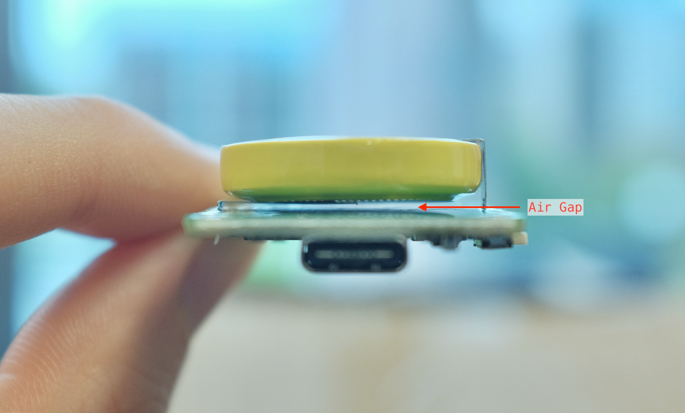
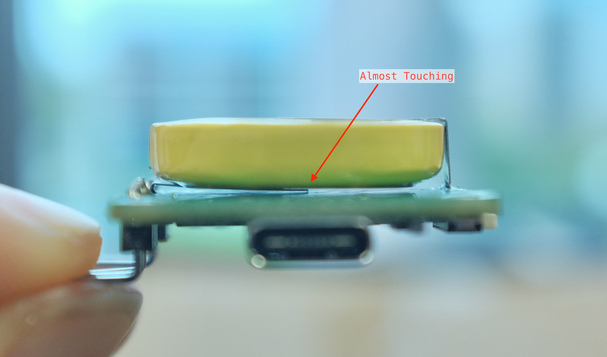

# The Baffling Intermittent Glitch

## Discovery

Recently a few of my customer told me that the daytripper they received didn't work properly after assembled. Once turned on, the LED on the TX unit would breath for a few seconds, then go completely dead and not responding to objects in front of the sensors. 

I initially provided them with free replacements right away, however it did make me wonder how did it happen, since I personally test every single board before mailing them out.

One of the customers told me that the affected TX would work fine on its own as a bare circuit board, but go bad once assembled with front and back plates, which was even more baffling. How could some screws and two acrylic plates affect the functionality of the circuit board?

## Investigation

I put together a handful of TX boards trying to replicate the problem, testing to make sure they work both before and after. I assembled about 20 of them before finally got one that's misbehaving. The board would work fine on its own, but stop working once the upper standoffs were tightened to a certain degree.

I hooked up a debugger to see where it was stuck in the firmware. It appeared to be waiting forever at [checking if a packet transmission is complete](https://github.com/dekuNukem/daytripper/blob/865081e2ba3adbdf7ebfdae3229aa89da2c86ae7/firmware/tx_bss/Src/helpers.c#L200). Looking deeper into that, the data received from SPI are all `0x0` instead of usual `0x13`.

I didn't think much of it and kept on messing around. At one point I desoldered the battery to see if it would help, and miraculously it did! The TX would work no matter how much the standoffs were tightened. 

Things became clear once I looked at the circuit board more closely. Here is the back of the affected TX board, you can just barely see a scratch mark near the center:

What happened was that, on certain batteries, the negative terminal tab sticks out more than others:

As a result, for the majority of the boards, there is an air gap between the bottom of the battery and the circuit board, all is well:

But on the affected boards, the protruding battery terminal is very nearly touching the circuit board:

Since they were not *actually* touching, everything would work fine when I test the bare circuit board myself. But when installed with fasteners, the back plate would push the terminal into the circuit board, scratching it, and grounding the SPI MISO data line. As a result, the firmware would get `0x0` from SPI, and stuck on waiting for a response.

## Remedy

From now on...

* Insulating materials will be added between the battery and circuit board

* Washers will be used so the back plate is less likely to push against the battery

* Visual inspection will be carried out to spot problem boards before shipping

* Traces will be rerouted away from potentially scratch-prone area in the future production run

## Existing Customers

This problem only affects a very small number of TX boards. If your daytripper is working fine, you don't have to do anything.

If you do encounter a similar problem, there are a number of ways to sort this out:

### Try Fixing It Yourself

* First disassemble the TX to bare circuit board

* Hold it like the above photos, check the gap and see if battery is touching the board

* Try inserting a piece of paper between the two to prevent them from touching. Gently pull the battery up slightly to widen the gap, then slide the paper in.

* If it works, congrats! Feel free to contact me for a partial refund for the trouble.

* If not...

### Contact Me

If you weren't able to fix it yourself, do feel free to contact me with your Tindie order number. I'll be happy to offer you a full refund or mail you another set for free.
