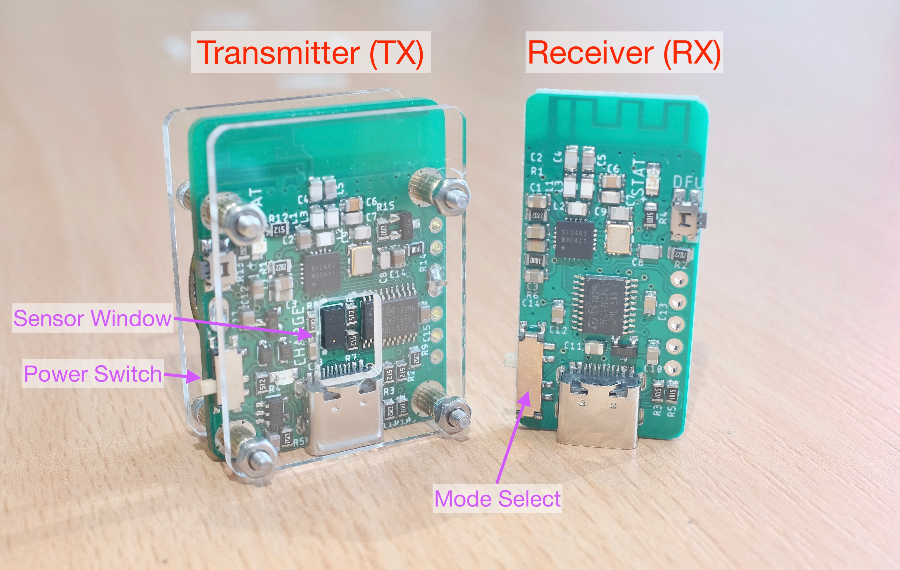
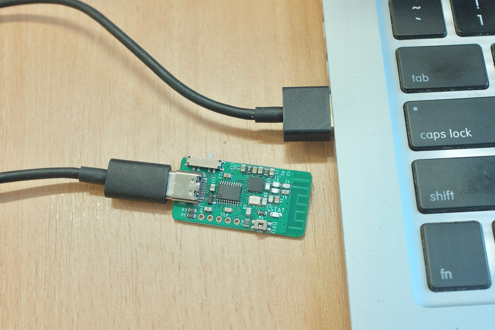
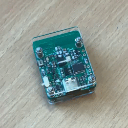
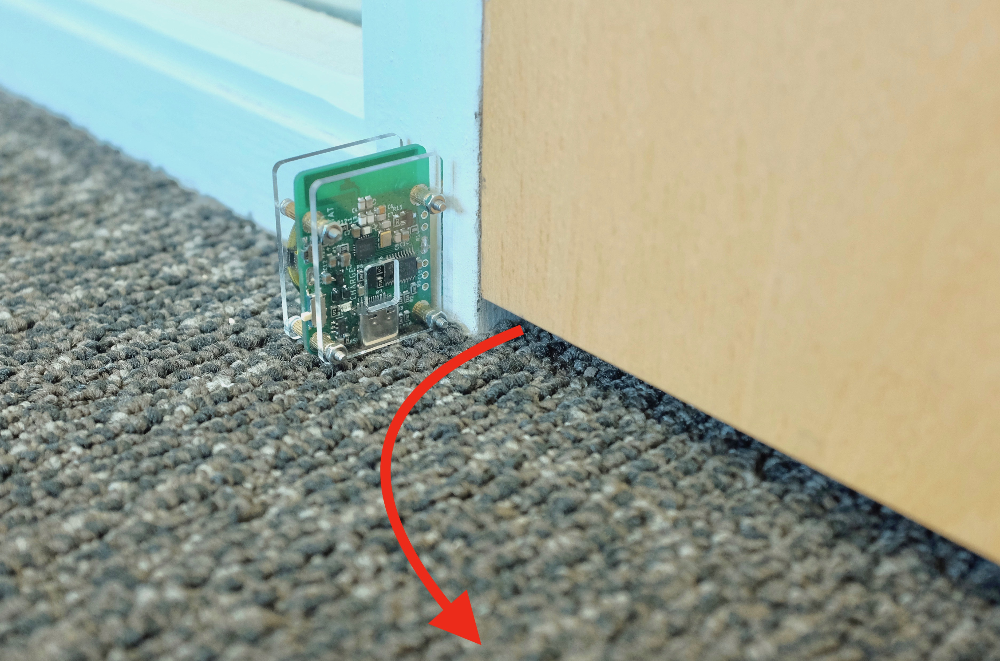
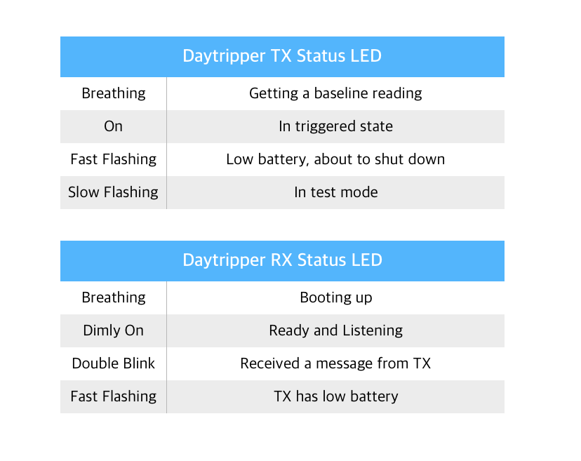

# Daytripper Quick Start Guide

[Buy on Tindie!](https://www.tindie.com/products/dekuNukem/daytripper-hide-my-windows-laser-tripwire/) | [Official Discord](https://discord.gg/VM4kbnf) | [Getting Started](quick_start_guide.md) | [Main Page](/README.md)

------

This guide shows you how to use the Daytripper.

If yours hasn't been assembled yet, please [see this guide to put it together](/assembly_guide.md)

## Getting Started

By now, you should have the assembled transmitter(TX) and receiver(RX) boards.

Please observe the various names that will be referred to later:

Your RX board should have a translucent protective cover, don't remove it!

Plug the RX into your computer. Its blue LED should start breathing then go dim, and your PC should recognize it as an USB keyboard.

Sometimes the system will install a driver, wait for it to finish.

Put the TX flat on the table. Turn it on (gently!) using the power switch.

The blue LED should start breathing, as the laser sensor gets a baseline distance reading.

Daytripper is triggered when further readings deviate too much from this initial baseline.

The blue LED should eventually go out, that means TX is armed and ready. 

Now put your hand in front of the sensor window, all your windows should be instantly minimized.

That's pretty much the gist of it! However please do keep reading for more important information.

## Mounting options

Now you know how Daytripper works, time to mount it at a desired location.

If you're trying to detect someone walking by, you can mount it to a wall using the included magnet.

* Simply tape the magnet to the wall, then you can attach and detach the TX with ease.

If you can find a metal surface, it's even easier:

To detect a door opening, simply put it on the ground so the door opens into it.

Those are just two suggestions, you can get as creative as you want!

## Test It Out!

It is very important that you **`TEST YOUR SETUP THOROUGHLY BEFORE USING IT FOR REAL!`**

A couple of key areas to note:

### Mounting Location

* Make sure the location provide adequate coverage for potential threats.

* You can conceal the TX if you want, just leave the sensor window clear, and don't touch the components on the circuit board.

### Power-On Order

* Always turn on the TX **`AFTER`** you finish mounting it, so the initial calibration won't get messed up by your hand.

### Motion Sensitivity

* Approach the TX like your potential threats would, does TX trigger consistently?

* If yes, congrats! You're all set.

* If not, you can turn up the refresh rate to make TX more sensitive to motion, at the cost of battery life.

* You can also leave TX plugged in at all times, in which case it will operate at the fastest refresh rate.

* To see how, **`finish reading this guide first`**, then head to the [Advanced Usage Guide](/advanced_usage.md).

### Your Applications

* Try it out with the application you're trying to hide!

* By default, RX will press `WIN + M` when triggered. This works with almost all desktop apps.

* However, it might not work with certain fullscreen games.

* If so, try switching your game to `borderless fullscreen` in graphic settings, if available.

* If all else fails, move the `Mode Select` switch to `LOCK` so RX will lock your computer instead.

* There is also a `Custom` option for executing custom commands, but that's for [advanced usages](/advanced_usage.md).

## Good to Know

Daytripper works by monitoring distance changes with an eye-safe laser sensor. As a result, there are some important information to keep in mind: 

* The laser works between 2cm to 120cm (0.8 to 47 inches), so make sure the motion happens within this range. 

* Daytripper works best in indoor conditions. Harsh ambient lighting such as direct sunlight might overwhelm the laser and affect detection range and sensitivity. 

* By default, the laser sensor scans at 6 times per second (Hz) while on battery power. It is automatically increased to 30Hz (fastest) when powered by USB.

* You can adjust a number of advanced parameters to suit your particular needs. Please see [this guide](/advanced_usage.md) for details.

* The transmission range between TX and RX is around 100 meters (330 feet) in open air. Although it is likely to be shorter in indoor environments with walls and other wireless interferences.

* The battery on TX should last around 50 hours with default configuration. You can recharge it using a USB Type-C cable.

* Don't touch the components on the circuit board with your bare hands, especially the laser sensor!

* Daytripper is most sensitive if the laser can be bounced straight back from the subject instead of at an angle.

* Certain materials might absorb the laser instead of reflecting it back, affecting performance. Those materials tends to be very deep black in color with a soft texture. 

## Troubleshooting

Both TX and RX have a blue status LED. The meanings are detailed in tables below. 

TX boards also have a yellow LED, which comes on when the battery is charging.

## Advanced Usages

Once you're familiar with how Daytripper works, you can take a look at the [Advanced Usage Guide](/advanced_usage.md) for some additional features that might be of interest.

## Disclaimers

Although I have spent a lot of time on this project, I cannot guarantee its functionality in every condition.

This is not a safety device, do not use it for safety critical situations. 

I am not responsible for the consequences of using this device. Use it at your own risk. 

## Questions or Comments?

Please feel free to [open an issue](https://github.com/dekuNukem/duckypad/issues), ask in the [official Daytripper discord](https://discord.gg/VM4kbnf), DM me on discord `dekuNukem#6998`, or email `dekuNukem`@`gmail`.`com` for inquires.

------

[Main Page](/README.md) | [Buy Daytripper](https://www.tindie.com/products/dekuNukem/daytripper)
